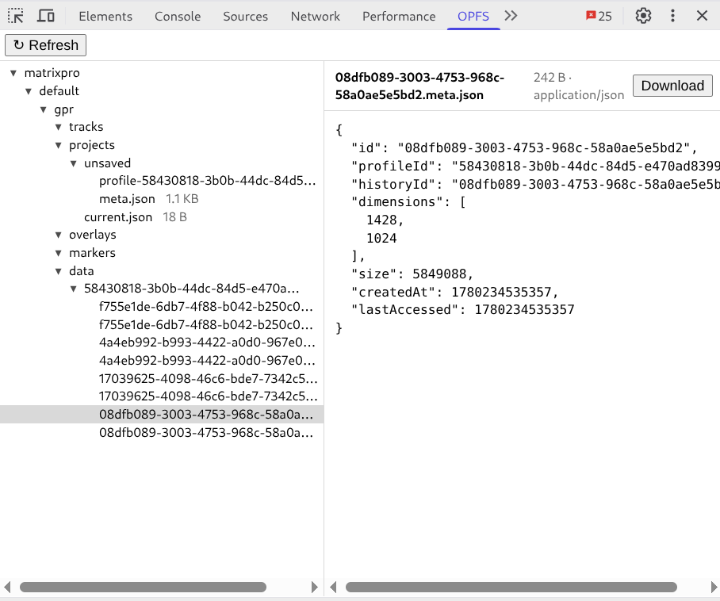

# OPFS Viewer

A DevTools panel for browsing a site's **Origin Private File System** (OPFS,
`navigator.storage.getDirectory()`). Adds an **OPFS** tab next to Elements /
Console that shows the inspected origin's OPFS tree and previews files.

Built for Chromium browsers (tested on Brave; Chrome-compatible). Manifest V3,
plain JS, no build step.



## How it works

OPFS is origin-sandboxed, so a DevTools panel can't read it directly. The panel
asks the service worker, which uses `chrome.scripting.executeScript` to run a
reader inside the inspected tab and relays the result back:

```
main.js → service-worker.js → executeScript (reads OPFS in the page) → back → render
```

The tree walk runs without recursion and caps concurrent I/O with a small task
pool, so large/deep trees stay safe and fast.

## Layout

```
manifest.json              root (required)
main.js                    panel entry point
icons/                     generated PNGs
src/service-worker.js      OPFS reader / relay
src/pages/devtools/        devtools.html + devtools.js (registers the panel)
src/pages/panel/           panel.html + panel.css
test/fixture.html          seeds OPFS edge-case data for testing
tools/                     icon generator
```

## Install (Load unpacked)

1. Open `brave://extensions` (or `chrome://extensions`).
2. Enable **Developer mode** (top-right).
3. Click **Load unpacked** and select this folder.
4. Open DevTools on any page → switch to the **OPFS** tab.

> Icons are generated, not committed-by-hand. To regenerate:
> `node tools/generate-icons.mjs`

## Refreshing

The panel re-reads OPFS automatically on natural cues — page navigation, the
panel being shown, and focus returning to the panel — and preserves expand /
collapse and selection across re-reads. There's also a manual **Refresh**
button. OPFS has no change events, so true live updates would need polling
(left out by design).

## Developing

After editing extension files, click **Reload** on the extension card in
`brave://extensions`. For DevTools panel changes you usually also need to
**close and reopen DevTools** to pick them up — that's expected, not a bug.

## Testing edge cases

Serve the fixture over `http://localhost` (OPFS needs a secure context), open
it, and click **Seed**:

```bash
python3 -m http.server 8000   # then open http://localhost:8000/test/fixture.html
```

It populates JSON, text, binary, an over-cap (6 MB) file, an empty folder, a
very long file name, and a worker-locked file — exercising every viewer branch.

## Limitations (v1.0)

- Read-only (browse, preview text, download). No rename/delete/upload.
- Reads the **top frame's** OPFS only; cross-origin iframes have separate OPFS.
- Inline preview is capped (5 MB); larger files are download-only.

## License

[MIT](LICENSE)
